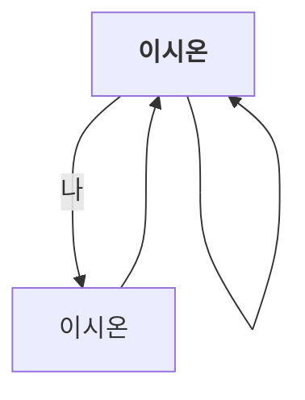
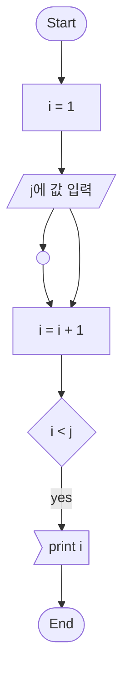
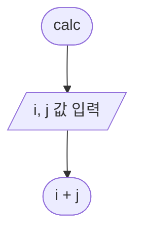
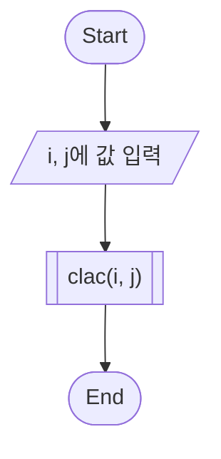
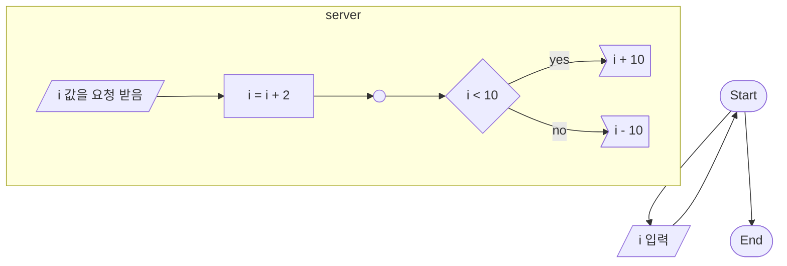

# test 폴더

여기 테스트임.

```mermaid
flowchart TB
p1["`**이시온**`"]
p2["이시온"]
p1 --->|"나"| p2
p1 --> p1
p2 --> p1
```

```mermaid
flowchart TB
st(["Start"])
p1["i = 1"]
inp1[/j에 값 입력/]
bl((" "))
p2["i = i + 1"]
cond1{"i < j"}
out1>"print i"]
en(["End"])
st --> p1
p1 --> inp1
inp1 --> bl
bl --> p2
inp1 --> p2
p2 --> cond1
cond1 -->|yes| out1
out1 --> en
```

```mermaid
flowchart TB
st(["calc"])
inp1[/i, j 값 입력/]
en(["i + j"])
st --> inp1 --> en
```

```mermaid
flowchart TB
st(["Start"])
inp1[/i, j에 값 입력/]
calc[["clac(i, j)"]]
en(["End"])
st --> inp1 --> calc --> en
```

```mermaid
flowchart TB
st(["Start"])
inp1[/i 입력/]
en(["End"])
subgraph server
inp2[/i 값을 요청 받음/]
p1["i = i + 2"]
bl1((" "))
cl{i < 10}
o1>"i + 10"]
o2>"i - 10"]
inp2 --> p1 --> bl1 --> cl -->|yes| o1
cl -->|no| o2
end
st --> inp1 --> st --> en
```